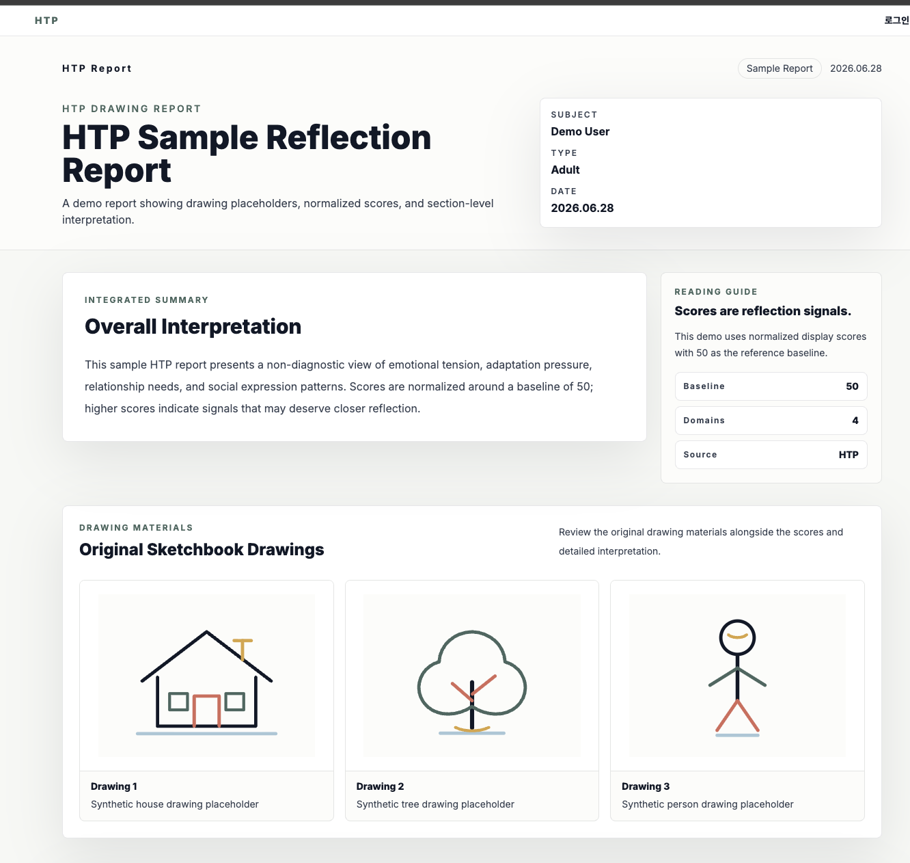
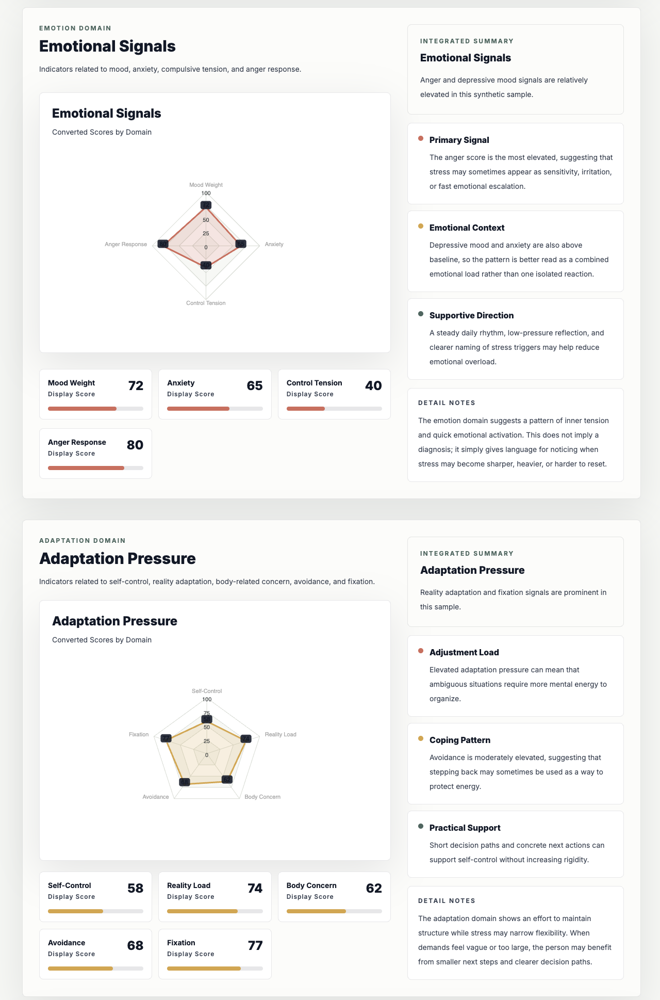
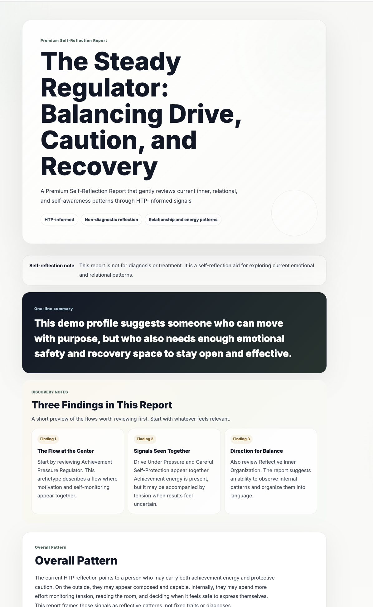
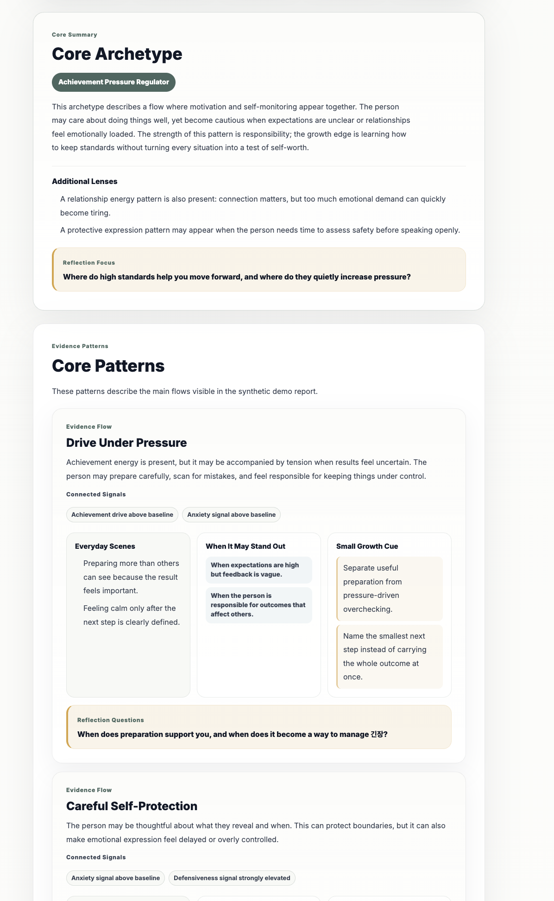

# HTP Web

HTP Web is a portfolio-safe public version of a full-stack TypeScript application for generating non-diagnostic, AI-assisted House-Tree-Person (HTP) psychology reflection reports. This repository focuses on the Angular report experience, application architecture, API shape, and product documentation while redacting proprietary report-generation logic.

> This project is intended for self-reflection and product demonstration only. It is not a medical, diagnostic, or treatment tool.

## What I Built

I rebuilt a legacy HTP report workflow into a modern full-stack application with a structured AI narrative layer. This public repository shows the frontend implementation and architecture while intentionally excluding the private scoring and generation engine.

- An Angular frontend with authenticated routes, admin dashboards, upload flows, reusable report sections, charts, visual cards, and print-oriented report pages.
- Typed frontend API clients and models that demonstrate how member/admin/report endpoints are consumed.
- A premium report renderer that turns structured report JSON into a polished, sectioned reading experience.
- Public documentation that explains the product architecture, API contract, safety posture, and demo setup.
- A redacted backend architecture note describing the private Node/Express + MySQL + LLM pipeline without exposing core IP.

## Why This Project Matters

This project is not just a static UI. The interesting product and engineering work is in designing a safe, inspectable AI-reporting experience around sensitive psychological content:

- The frontend separates basic reports, premium reports, member views, and admin QA surfaces.
- Report rendering is componentized into reusable cards, sections, charts, reflection prompts, visual registries, and print pages.
- API clients and models are typed so the UI remains aligned with backend contracts.
- User-facing language is governed by non-diagnostic tone and safety rules.
- Proprietary scoring, prompt, and interpretation logic is intentionally redacted from the public copy.

## Product Screenshots

### Basic HTP Report



### Premium Report



### Premium Report Detail



### Premium Pattern Sections



## Architecture

```text
Angular frontend
  -> authenticated member/admin routes
  -> upload, basic report, premium report, admin QA UI

Private Express backend (redacted)
  -> auth middleware and route controllers
  -> HTP analysis, pattern detection, MBTI comparison, premium payload services
  -> LLM prompt/provider/report validation pipeline
  -> MySQL persistence

Documentation
  -> API contract, DB map, report pipeline, tone/safety rules, product roadmap
```

## Private Production Data Flow

```text
User upload / legacy HTP data
  -> MySQL records
  -> backend analysis and feature extraction
  -> structured LLM report input
  -> prompt template and safety/tone rules
  -> PremiumNarrativeReport JSON
  -> mde_premium_report persistence
  -> Angular report renderer
```

## Key Engineering Decisions

- **Portfolio-safe redaction**: The public repository excludes HTP scoring, prompt construction, report-input generation, and pattern rules.
- **Structured report contract**: The frontend consumes a typed `PremiumNarrativeReport` shape rather than free-form text.
- **Separation of basic and premium reports**: Existing HTP report views remain separate from AI-generated premium narratives.
- **Admin-first QA surface**: Admin UI routes show how report generation, payload inspection, and history review are organized.
- **Non-diagnostic safety layer**: Tone rules avoid clinical diagnosis, deterministic identity claims, and overconfident psychological labeling.

## Tech Stack

- Frontend: Angular 20, RxJS, ApexCharts, Tailwind CSS
- Backend: Node.js, Express 5, TypeScript, MySQL (private production source redacted)
- AI: OpenAI Responses API through a provider interface, with a mock provider for safe local testing
- Auth: JWT-style bearer tokens with bcrypt/legacy password verification

## Recruiter Review Guide

Good starting points for code review:

- `frontend/src/app/premium-report/components/premium-report-renderer/` - main premium report renderer.
- `frontend/src/app/auth/` - Angular auth/session flow.
- `frontend/src/app/admin/services/` - admin API client patterns.
- `frontend/src/app/premium-report/models/` - typed premium report contract.
- `frontend/src/app/reports/` - basic HTP report view models and renderer support.
- `docs/api_spec.md` - backend API contract.
- `docs/public-architecture-overview.md` - public/redacted architecture overview.
- `docs/tone-system/` - non-diagnostic writing and safety rules.

## Repository Structure

```text
backend/
  README.md          Redaction note and private backend architecture summary
  .env.example       Public-safe environment variable template
  package.json       Backend package metadata retained for stack context

frontend/
  src/app/
    admin/           Admin API clients, models, navigation
    auth/            Login/signup/session flow
    pages/           Route-level screens
    premium-report/  Premium report renderer, sections, models, visual registry
    reports/         Basic report models/mappers/services
    shared/          Reusable report and chart components
    sketchbook/      Upload flow
  src/assets/        Public demo assets and owned/generated visual assets

docs/
  Public architecture overview, API shape, tone/safety, route map, and demo guidance
```

## Local Development

Prerequisites:

- Node.js 22+
- MySQL 8+
- npm

### Backend

The production backend source is redacted from this public portfolio copy. See `backend/README.md` and `docs/public-architecture-overview.md`.

### Frontend

```bash
cd frontend
npm install
npm start
```

The frontend defaults to `http://localhost:3000` as the API base URL.

## Useful Commands

```bash
# Backend
cd backend
npm run typecheck
npm run build

# Frontend
cd frontend
npm run build
```

The frontend can be reviewed independently from the private backend implementation.

## Demo Data And Screenshots

For a public portfolio, use only synthetic demo data. Recommended screenshots:

- Member report list
- HTP basic report view
- Premium report hero and summary
- Premium pattern/resource card sections
- Admin premium payload or report history page

See `docs/portfolio-demo-guide.md` for the public-demo checklist.

## Public Portfolio Notes

This repository intentionally excludes private runtime files, generated artifacts, local caches, uploaded user files, raw LLM/debug outputs, and third-party style-reference material. See `PORTFOLIO_AUDIT.md` for the curation rationale.

## License

MIT
